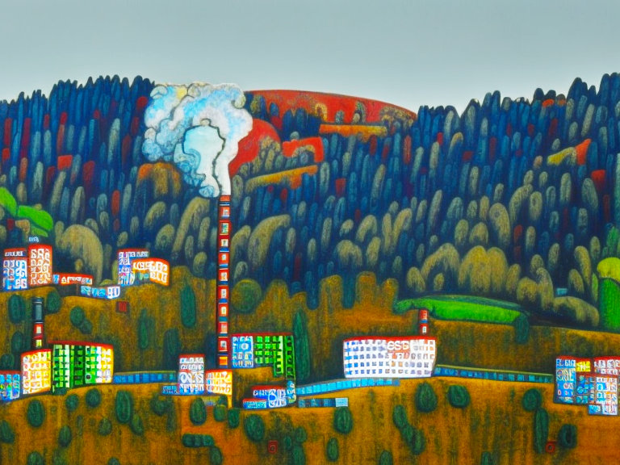

# Die Stadtgemeinde Lenzing an der Ager in Oberösterreich: Info und Fakten

Lenzing an der Ager ist eine Stadtgemeinde in Oberösterreich, im Bezirk Vöcklabruck und Gerichtsbezirk Vöcklabruck gelegen. 

## Zahlen und Fakten

Die Gemeinde hat eine **Fläche** von 8,89 km2 und eine **Seehöhe** von 502,943 m (Messpunkt Gemeindeamt). Laut einer Statistik vom 31.12.2017 hatte Lenzing 5.066 Einwohner.

**Das Wappen von Lenzing** zeigt eine silberne Wellenleiste, die schräg rechts geteilt ist. Oben ist eine silberne, zur Hälfte blau gefüllte Retorte in Rot dargestellt und unten ein silberner Nadelbaum in Blau. Diese Symbole spiegeln die Bedeutung der örtlichen Wirtschaft wider, wobei die Retorte die [chemische Industrie](https://www.lenzing.com/) und der Nadelbaum die Papier- und Holzverarbeitung repräsentieren. Das silberne Wellenband steht für den Fluss [Ager](https://de.wikipedia.org/wiki/Ager). Die Gemeindefarben sind Rot, Weiß und Blau.

## Umwelt und Naturschutz 

In Lenzing ist ein gut ausgebautes Wasser- und Kanalisationsnetz vorhanden. Das Gemeindestraßennetz ist 60,63 km lang. Die Müllbeseitigung erfolgt im Rahmen einer Müllabfuhrgemeinschaft mit anderen Gemeinden und das [Abfallsammelzentrum](https://www.altstoffsammelzentrum.at/wo_wann_was/asz/show/Asz/seewalchen.html "ASZ Attersee-Nord") befindet sich im Industriegebiet 10 im Gemeindegebiet von Seewalchen.

## Verkehrsanbindung

Lenzing ist **mit dem Auto** über die Westautobahn (A1), Ausfahrt Seewalchen am Attersee und dann über die Bundesstraße (B 151) ca. 3 km Richtung Vöcklabruck zu erreichen. 

**Mit der Bahn** ist die Gemeinde über die Westbahnstrecke und Ausstieg in Attnang-Puchheim (Bahnknotenpunkt) zu erreichen. Es gibt zwei Einstiegsmöglichkeiten: Bahnhof Lenzing für den Bereich Lenzing AG, Gallaberg und Alt Lenzing und Haltestelle Lenzing für das Ortszentrum, Neubrunn und den Bereich Agerstraße. Die reine Fahrzeit von Attnang nach Lenzing beträgt ca. 15 Minuten.

## Wirtschaft

In Lenzing gibt es eine [Vielzahl von Arbeitgebern](/arbeitgeber-unternehmen-wirtschaftsbetriebe-lenzing/ "Vielfalt der Wirtschaft: Unternehmen und Arbeitgeber, die Lenzing prägen") aus unterschiedlichen Branchen:

* [Lenzing AG](https://www.lenzing.com/) &ndash; Lenzing stellt Fasern her, die in einer breiten Palette von Produkten verwendet werden, darunter Mode, Heimtextilien, Schutzkleidung, Outdoorbekleidung, Kosmetik, Hygieneprodukte und High-Tech-Produkte.
* [Salesianer](https://www.salesianer.at/) &ndash; Die SALESIANER Gruppe ist ein führendes Familienunternehmen in der Region Österreich, Zentral-, Süd- und Osteuropa, das sich auf nachhaltiges Textilmanagement spezialisiert hat. Sie bietet hochwertige Wäschereidienstleistungen und Miettextilien für verschiedene Branchen wie Gesundheitswesen, Hotellerie und Gastronomie sowie Industrie und Gewerbe. Darüber hinaus werden Reinraumtextilien, Waschraumhygiene sowie Werbe- und Schmutzfangmatten angeboten.
* [Dorfsalon ](https://www.dorfsalon.at/) &ndash; Der Dorfsalon in Lenzing bietet als Bio-Café, Kurs- und Begegnungsort, Praxisraum und Co-Making-Space für Keramik eine offene, innovative und freudvolle Umgebung zur Selbstverwirklichung und möchte als Impulsgeber für ein blühendes Leben in der Region Vöcklabruck/Attersee inspirieren.
* [Jodl](https://www.jodl.at/) &ndash; JODL ist ein Hersteller von flexiblen Lebensmittelverpackungen, darunter Automatenfolien, Blockbodenbeutel, Kreuzbodenbeutel, Standbodenbeutel und der selbst entwickelte Diamantbeutel. Mit über 50 Jahren Erfahrung setzt das Unternehmen auf höchste Qualität, Kundenorientierung und Lieferzuverlässigkeit, um seinen Kunden den entscheidenden Wettbewerbsvorteil zu verschaffen.
* [Autohaus Graiger GmbH](https://www.opel-graiger.at/ "Neu- und Gebrauchtfahrzeuge, Zweiräder, Ersatzteile und Zubehör sowie Service- und Reparaturarbeiten.") &ndash; Opel Graier bietet eine breite Palette von Dienstleistungen wie den Verkauf von Neu- und Gebrauchtwagen, Zweirädern, Ersatzteilen und Zubehör sowie Service- und Reparaturarbeiten für alle Marken und Unfallschadenreparaturen.
* [SML](https://www.sml.at/) &ndash; Durch Kundenorientierung, intensive Forschung und Entwicklung sowie jahrzehntelange Erfahrung gilt SML als weltweit führend in der Extrusionstechnologie und betreibt Anlagen in über 100 Ländern für Unternehmen der Kunststoff-, Verpackungs- und technischen Textilindustrie.

Dies sind nur einige Beispiele, es sind noch viele weitere Betriebe in Lenzing ansässig.
