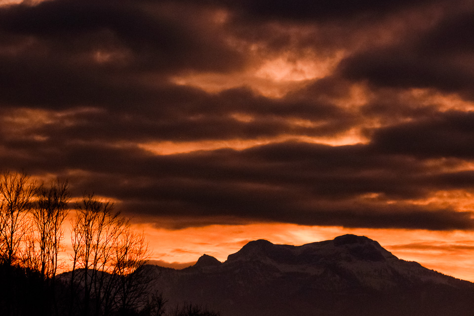

# Der Schafberg: Ein atemberaubender Berg mit reicher Geschichte

Der Schafberg ist einer der bekanntesten Berge in der Region
Salzkammergut, in Oberösterreich. Mit einer Höhe von 1.782 Metern bietet
er einen atemberaubenden Panoramablick auf die umliegende Landschaft und
den Wolfgangsee.

## Lage und touristische Informationen

Der Schafberg befindet sich in der Nähe der Stadt St. Wolfgang und ist
leicht mit [der Zahnradbahn](https://de.wikipedia.org/wiki/Schafbergbahn "Schafbergbahn") zu erreichen. Die Zahnradbahn wurde bereits
1893 eröffnet und ist eine der steilsten Adhäsionsbahnen der Welt. Sie
führt die Besucher auf eine malerische Fahrt durch die Landschaft bis
zur Spitze des Schafbergs, wo sich ein [Panoramarestaurant und ein Hotel](https://schafberg.net/restaurant/ "Restaurant im Berghotel")
befinden.

Der Schafberg ist ein beliebtes Ziel für Wanderer, Bergsteiger und
Naturliebhaber. Es gibt [zahlreiche Wanderwege](https://www.komoot.de/highlight/1556402 "Schafberg Wander-Highlight") in der Umgebung, die den
Besuchern die Möglichkeit geben, die atemberaubende Aussicht auf die
umliegenden Berge und Seen zu genießen. Es gibt auch viele Möglichkeiten
für Outdoor-Aktivitäten wie Klettern, Mountainbiken und Paragliding.

Auf dem Gipfel des Schafbergs befindet sich eine Kapelle, die dem Heiligen Wolfgang gewidmet ist und von vielen Pilgern besucht wird. Die Kapelle wurde im 17. Jahrhundert erbaut und ist ein bedeutendes Kulturdenkmal in der Region.

Die Zahnradbahn auf den Schafberg ist nicht nur ein Transportmittel für Touristen, sondern auch eine technische Meisterleistung. Die Bahnstrecke hat eine Länge von 5,85 Kilometern und überwindet einen Höhenunterschied von 1.190 Metern. Die Bahn fährt entlang einer steilen Strecke mit einer Steigung von bis zu 26 Prozent und bietet den Fahrgästen ein unvergessliches Erlebnis.

Der Schafberg ist nicht nur ein wichtiger touristischer Ort, sondern hat auch historische und geologische Bedeutung. Der Berg besteht aus Kalkstein und wurde während der letzten Eiszeit geformt. Die Kalksteinfelsen des Schafbergs sind auch ein beliebter Ort für Kletterer und bieten eine Vielzahl von Kletterrouten für alle Schwierigkeitsgrade.

In der Geschichte spielte der Schafberg eine wichtige Rolle im Salzkammergut, einer Region in Österreich, die für ihre Salzminen bekannt ist. Während des Salzabbaus im 16. Jahrhundert wurden auch Holzstämme vom Schafberg zum Transport von Salz genutzt. Heute erinnern noch einige Stellen auf dem Berg an diese Zeit.

Der Schafberg ist auch ein wichtiger Lebensraum für verschiedene Tierarten, darunter das Alpenschneehuhn und die Gebirgslibelle. Im Rahmen des Naturschutzes wurden Maßnahmen ergriffen, um den Lebensraum für diese Arten zu schützen und zu erhalten.

## Geschichte

Der Schafberg hat eine reiche Geschichte und war schon früh ein
beliebtes Reiseziel für Touristen. Im Jahr 1873 besuchte Kaiser Franz
Joseph I. den Berg und war so begeistert von der Aussicht, dass er den
Bau der Zahnradbahn in Auftrag gab. Die Bahn wurde 1893 eröffnet und ist
seitdem ein wichtiger Teil des Tourismus in der Region.

Während des Zweiten Weltkriegs wurde der Schafberg von den Nazis als
Beobachtungsposten genutzt. Nach dem Krieg wurde der Berg von den
Alliierten besetzt und als Beobachtungsposten gegen die sowjetische
Armee genutzt.

Heute ist der Schafberg ein wichtiger Teil des Tourismus in der Region
Salzkammergut und ein beliebtes Ziel für Touristen aus der ganzen Welt.

## Fazit

Der Schafberg ist ein atemberaubender Berg mit einer reichen Geschichte
und einem wichtigen Platz im Tourismus der [Region Salzkammergut](). Mit
seiner spektakulären Aussicht und zahlreichen Outdoor-Aktivitäten ist er
ein beliebtes Ziel für Wanderer, Bergsteiger und Naturliebhaber. Wer in
der Nähe ist, sollte unbedingt einen Besuch auf den Schafberg einplanen,
um diese atemberaubende Landschaft zu erleben.

