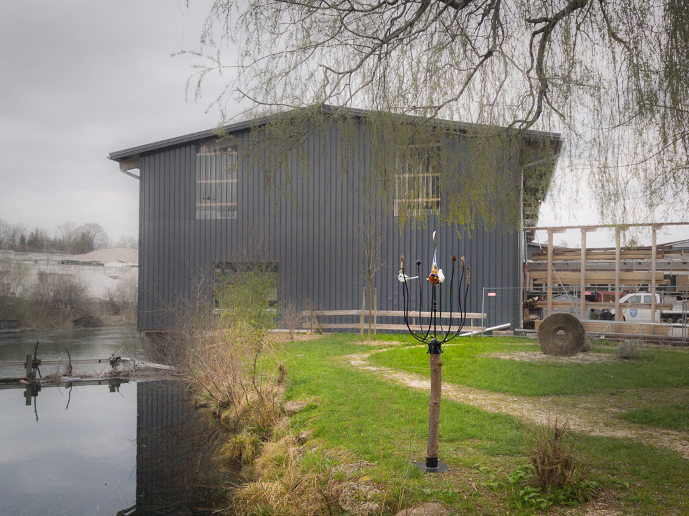

Fast drei Jahre gibt es GeZuWa nun schon - höchste Zeit also für eine Vollversammlung aller Mitglieder im Leimer Bräu - Hotel Restaurant Gasthausbrauerei, die Obmensch Max mit einigen guten Nachrichten eröffnete.

😊 Die guten Nachrichten zuerst: In den vergangenen Jahren hat unser junger Verein das Gemeinschaftsleben in Lenzing sichtbar mitgestaltet.

🎄 Am **Lenzinger Weihnachtsmarkt** wurde zuerst Gutes ausgeschenkt und anschließend mit dem Verkaufserlös Gutes für Bedürftige aus Lenzing getan.

⛹️‍♀️ Die **Agerlympics**, spielerische Wettbewerbe auf der Agerinsel im Rahmen des Ferienspasses, haben Lenzinger Kinder in den Sommerferien unterhalten und sportlich gefordert.

💡 Wie soll der neue **Hauptplatz** gestaltet werden? Ideen und Vorschläge dazu haben die Mitglieder von GeZuWa dem Team um Architekt Walter Stelzhammer und den Vertretern aus dem Gemeindeamt präsentiert.

🌳 Das **[GeZuWa-Platzl](https://www.openstreetmap.org/?#map=19/47.952010/13.607752 "GeZuWa-Platzl an der Ager")** an der Ager nimmt Formen an: Die Bepflanzung sprießt, Sitzbänke und Blickfänge für die Spaziergänger auf dem Agermühlenweg kommen bald.

🗳 Zur Obfrau wurde Ramona G. Gaina einstimmig gewählt. Mit ihr im Vorstand arbeiten Julia Laganda als Kassierin, Astrid Ehrnleitner als Schriftführerin, Ján Gallik als Obfrau-Stellvertreter und Elisabeth Zauner als Stellvertreterin von Kassierin und Schriftführerin (nicht im Bild).

Ramona skizzierte, wo die Reise für GeZuWa hingeht: Eigene Vereinsprojekte forcieren, neue Mitglieder anziehen und Lenzing im Zusammenwirken vieler freiwillig engagierter Menschen Stückchen für Stückchen noch lebenswerter und attraktiver gestalten.

