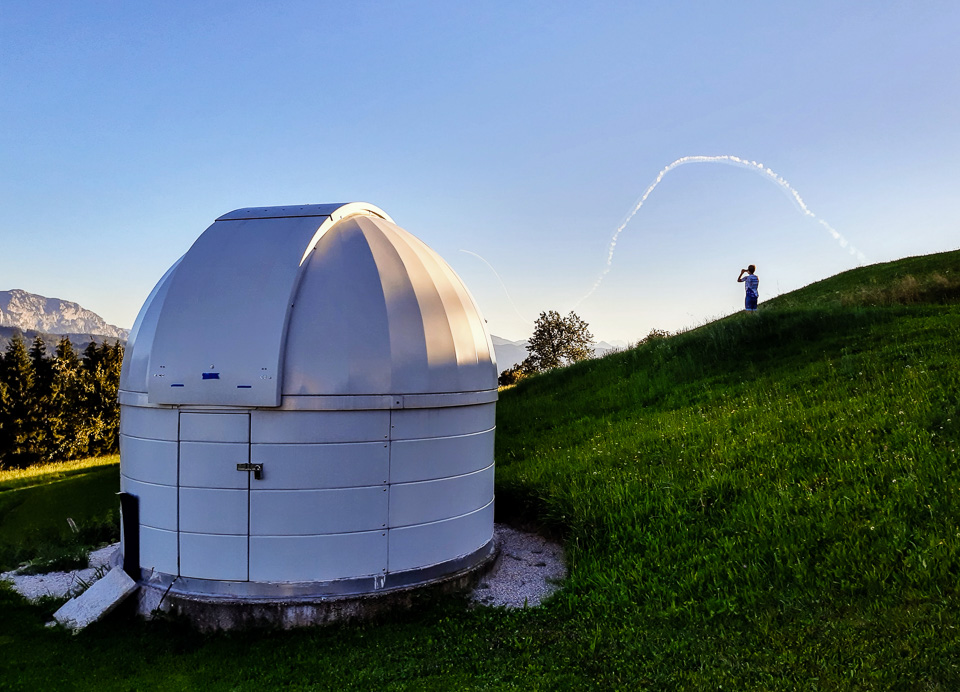
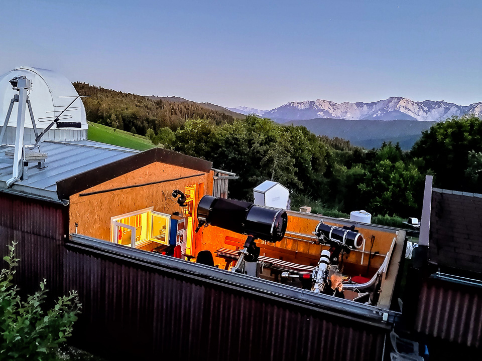

Wusstest du, dass es eine Sternwarte auf Lenzinger Boden gibt?

Tatsächlich: Die [Sternwarte Gahberg](https://astronomie.at/ "Astronomischer Arbeitskreis Salzkammergut - Sternwarte Gahberg") steht auf einem Grundstück, das die Gemeinde Lenzing damals® für den Bau eines Kinder-Erholungsheims kaufte.

Das und noch viel mehr haben wir von Erwin Filimon und seinen Vereinskolleg*innen erfahren. Erwin ist der Obmann des [Astronomischen Arbeitskreises Salzkammergut](https://www.astronomie.at/) (und GeZuWa-Mitglied 😉)

Fünfzig und mehr Stunden braucht Günter Kerschhuber zum Beispiel, bis [ein solches Foto](https://astro-photo.at/index.html/Nebula/index.html#img=Sh2-134%20LBN489%20LBN491.jpg "Nebula") fertig ist:

Herzlichsten Dank für die Gastfreundschaft!
