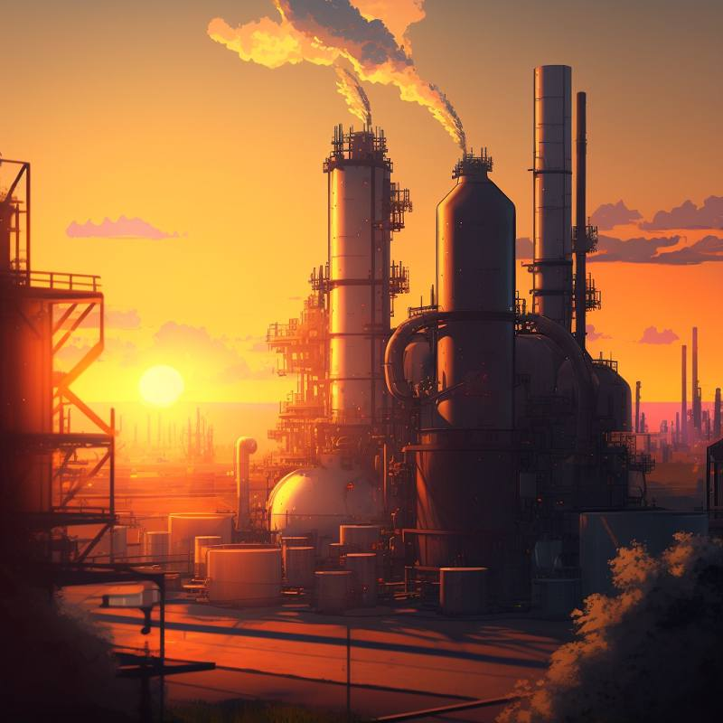

# Viscosefasern - Eine Einführung in die industrielle Produktion

## Was sind Viscosefasern?

Viscosefasern sind synthetische Fasern, die aus Zellulose hergestellt werden. Sie zeichnen sich durch eine weiche und glatte Textur, sowie gute Feuchtigkeitsaufnahme aus.

## Herstellungsprozess

Der Herstellungsprozess von Viscosefasern kann in sechs Hauptschritte unterteilt werden:

1. Vorbereitung der Zellulose: Die Zellulose wird aus Holz oder Baumwollresten gewonnen und in eine lösliche Form umgewandelt.
2. Spinnung: Die lösliche Zellulose wird in einer Spinnlösung aufbereitet und zu Fasern gesponnen.
3. Vereinigung: Die Fasern werden zu einem Strang zusammengefügt.
4. Aufbereitung: Der Strang wird in einem Trocknungsprozess stabilisiert und geglättet.
5. Konfektion: Die Viscosefasern werden zu Garn verarbeitet.
6. Verwendung: Das Garn wird schließlich zu verschiedenen Textilprodukten verarbeitet.

## Vorteile und Nachteile

Viscosefasern haben in der Textilindustrie eine wichtige Rolle, da sie sich durch verschiedene Vorteile auszeichnen. Viscosefasern sind zum Beispiel sehr weich, geschmeidig und glatt, was sie zu einem angenehmen Material für Kleidung und Heimtextilien macht. 

Die Fasern haben außerdem einen seidigen Glanz und eine hohe Farbbrillanz, wodurch sie sich für verschiedene Arten von Textilien eignen.

Ein weiterer Vorteil von Viscosefasern ist, dass sie feuchtigkeitsabsorbierend und atmungsaktiv sind. Dies macht sie zu einem idealen Material für Sommerkleidung oder für Sportbekleidung. Zudem sind Viscosefasern relativ pflegeleicht und können einfach gewaschen werden.

Neben diesen Vorteilen gibt es allerdings auch einige Nachteile von Viscosefasern. Wie bereits erwähnt, erfordert die Herstellung der Fasern große Mengen an Wasser und Energie, was zu einem hohen Wasserverbrauch und CO2-Emissionen führt. Darüber hinaus kann die Verwendung von giftigen Chemikalien bei der Herstellung der Fasern zu Umweltverschmutzungen führen, wenn diese nicht ordnungsgemäß entsorgt werden.

Ein weiterer Nachteil von Viscosefasern ist, dass sie im Vergleich zu synthetischen Fasern wie Polyester und Nylon weniger strapazierfähig sind und leichter reißen oder verblassen können. Zudem sind sie empfindlicher gegenüber Feuchtigkeit und können bei zu hohen Temperaturen schrumpfen oder verfilzen.

Trotz dieser Nachteile spielen Viscosefasern eine wichtige Rolle in der Textilindustrie und bieten viele Vorteile, die von Verbrauchern geschätzt werden. 

Es ist jedoch wichtig, dass die Herstellung von Viscosefasern umweltfreundlicher gestaltet wird, um die negativen Auswirkungen auf die Umwelt zu reduzieren.

## Umweltauswirkungen

Der Herstellungsprozess von Viscosefasern hat auch negative Auswirkungen auf die Umwelt. Insbesondere sind bei der Herstellung der Fasern große Mengen an Wasser und Energie erforderlich, was zu einem hohen Wasserverbrauch und CO2-Emissionen führt. Darüber hinaus werden bei der Herstellung von Viscosefasern oft giftige Chemikalien wie Schwefelwasserstoff und Kohlenstoffdisulfid eingesetzt, die bei unsachgemäßer Handhabung Umweltverschmutzungen verursachen können.

Allerdings gibt es mittlerweile auch umweltfreundliche Herstellungsverfahren für Viscosefasern, die sich durch einen geringeren Einsatz von Energie, Wasser und Chemikalien auszeichnen. Ein Beispiel ist das sogenannte [Lyocell-Verfahren](https://de.wikipedia.org/wiki/Lyocell), das auch unter dem Markennamen [TENCEL®](https://www.tencel.com/de) bekannt ist.

Das Lyocell-Verfahren nutzt eine geschlossene Kreislauftechnologie, bei der die Chemikalien wiederverwendet und das Abwasser recycelt wird. 
Dadurch wird der Verbrauch von Wasser und Chemikalien deutlich reduziert. 

Das Verfahren nutzt außerdem eine spezielle Zellulose-Quelle aus schnell nachwachsenden Holzarten, die einen geringeren Einfluss auf die Umwelt haben als herkömmliche Zellulose-Quellen. Ein weiterer Vorteil des Lyocell-Verfahrens ist, dass es keine giftigen Chemikalien wie Schwefelwasserstoff oder Kohlenstoffdisulfid benötigt, was das Risiko von Umweltverschmutzungen reduziert.

Ein weiteres umweltfreundliches Verfahren ist das sogenannte [Cupro-Verfahren](https://de.wikipedia.org/wiki/Cupro), das auch unter dem Markennamen [Bemberg™](https://www.asahi-kasei.co.jp/fibers/en/bemberg/) bekannt ist. Das Verfahren nutzt als Rohstoff Baumwollreste und produziert Viscosefasern mit einer besonders glatten und weichen Oberfläche. Im Gegensatz zu herkömmlichen Viscoseverfahren werden bei der Herstellung von Cupro keine giftigen Chemikalien wie Schwefelwasserstoff oder Kohlenstoffdisulfid eingesetzt. Zudem nutzt das Verfahren eine geschlossene Kreislauftechnologie, wodurch der Verbrauch von Wasser und Chemikalien minimiert wird.

## Fazit

Insgesamt gibt es mittlerweile verschiedene umweltfreundliche Verfahren zur Herstellung von Viscosefasern. Diese Verfahren zeichnen sich durch einen geringeren Einsatz von Wasser, Energie und Chemikalien aus und tragen somit dazu bei, die negativen Auswirkungen auf die Umwelt zu reduzieren. Verbraucher können dazu beitragen, die Umweltbelastung zu reduzieren, indem sie sich für Textilien aus umweltfreundlich produzierten Viscosefasern entscheiden.

Insgesamt kann man sagen, dass Viscosefasern eine wichtige Rolle in der Textilbranche spielen und viele Vorteile bieten, jedoch auch negative Auswirkungen auf die Umwelt haben. Es ist wichtig, sich bewusst für nachhaltig produzierte Viscosefasern zu entscheiden, um den negativen Auswirkungen entgegenzuwirken.

