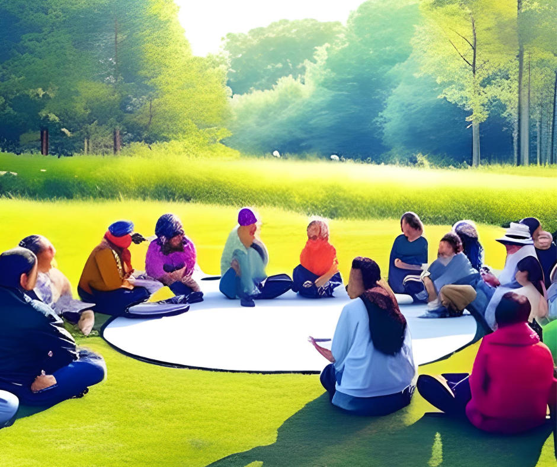

# GeZuWa - Gemeinschaft zusammen wachsen: Ein Rückblick auf das Ende einer Ära

In einer bewegenden Sitzung am Abend des 24. Mai 2023 hat der Verein für Dorf- und Stadtentwicklung „GeZuWa - Gemeinschaft zusammen wachsen” offiziell sein Bestehen beendet. 

Seit dem Jahr 2017 hatte der Verein zahlreiche Aktivitäten entfaltet, um das Gemeinschaftsleben in Lenzing zu stärken und die Menschen zu motivieren, sich im Gemeindeleben einzubringen. Mit dem Ende von GeZuWa geht eine Ära zu Ende, die in der Geschichte Lenzings einen bedeutenden Fußabdruck hinterlässt.

## Gemeinschaftsgefühl stärken und miteinander bewegen

GeZuWa hatte stets den Wunsch und das Ziel, das Gemeinschaftsgefühl in Lenzing zu stärken und die Lenzinger:innen dazu zu motivieren, sich aktiv am Gemeindeleben zu beteiligen. Der Verein setzte sich dafür ein, dass die Lenzinger Bevölkerung nicht nur Projekte der Gemeinde unterstützt, sondern auch eigene Ideen einbringt und umsetzt. 

Dieser Ansatz war von Anfang an der Motor für die Vielzahl an Aktivitäten und Projekten, die der Verein im Laufe der Jahre initiierte.

## Rückblick auf die Aktivitäten von GeZuWa

Der Verein GeZuWa hinterlässt der Gemeinde Lenzing ein Vermächtnis voller Aktivitäten, die das Gemeinschaftsleben gestärkt und die Menschen zusammengebracht haben. Im Folgenden werden einige dieser Aktivitäten und Projekte näher beleuchtet:

### AgerLympics 2018 - Ein sportliches Highlight für Kinder

Im Rahmen des Ferienspasses der Marktgemeinde Lenzing organisierte GeZuWa im Jahr 2018 die Veranstaltung [„AgerLympics”](https://www.facebook.com/gezuwa/posts/pfbid0322g5VbXCbBDLi5B1Mcgbrht9Whge5pt8Tkxf2wDz7scN4uzPE2XM5zW7qzKxJgBDl). Bei diesem Event bewiesen viele motivierte Kinder auf der Agerinsel ihre Geschicklichkeit und Ausdauer bei verschiedenen Teambewerben. Die AgerLympics waren ein großer Erfolg und trugen maßgeblich zur Förderung des Teamgeists und der sportlichen Aktivitäten der Kinder bei.

## GeZuWa-Platzl - Ein Ort der Ruhe und Meditation

Im Jahr 2019 wurde das [GeZuWa-Platzl](https://www.facebook.com/gezuwa/photos/a.585305558890027/585337658886817/) errichtet, ein öffentlich zugänglicher Tiny Park nahe der Ager und der Raudaschlmühle. Der Park dient als ein erlebenswerter Ruhe- und Meditationspunkt entlang des Agermühlen-Weges. Hier können die Menschen abschalten, die Natur genießen und neue Energie tanken. Das GeZuWa-Platzl wurde zu einem beliebten Ort für Einheimische und Besucher gleichermaßen.

### GeZuWa-Park - Die Wiederbelebung eines vergessenen Juwels

Der [GeZuWa-Park im Ortskern von Lenzing](https://goo.gl/maps/jKGJoMfmEQ51pTEcA?coh=178573&entry=tt) nahe dem Friseursalon HaarDesign Dagmar & Roswitha Haas wurde zu einem besonderen Anziehungspunkt. 

In jüngster Zeit erfuhr der Park eine Renaissance und wurde zum prominenten Thema im Planungsausschuss des Lenzinger Gemeinderates. 

Der GeZuWa-Park, der lange Zeit in Vergessenheit geraten war, wird nun als ein Ort der Begegnung und des gemeinsamen Erlebens betrachtet. Die Bemühungen von GeZuWa trugen dazu bei, das Bewusstsein für die Schönheit und den Wert des Parks zu wecken, und legten den Grundstein für zukünftige Entwicklungen und Aktivitäten in diesem Bereich.

### Weitere Projekte und Engagements

Neben den genannten Beispielen gab es noch eine Vielzahl weiterer Aktivitäten und Projekte, bei denen sich der Verein GeZuWa engagierte. Der Verein war stets bestrebt, das Gemeinschaftsgefühl zu stärken und die Menschen in Lenzing dazu zu ermutigen, ihre Talente, Ideen und Ressourcen für das Wohl der Gemeinschaft einzusetzen.

## Ein Abschied und ein Blick in die Zukunft

Mit der Beendigung des Vereins GeZuWa geht eine Ära zu Ende, die in Lenzing einen bleibenden Eindruck hinterlässt. Die zahlreichen Aktivitäten und Projekte, die der Verein im Laufe seiner Existenz initiierte, haben das Gemeinschaftsleben gestärkt, das Miteinander gefördert und die Menschen in Lenzing inspiriert, sich aktiv für ihre Gemeinde einzusetzen.

Auch wenn der Verein GeZuWa nun nicht mehr besteht, wird sein Einfluss in Lenzing weiterleben. Die erfolgreichen Veranstaltungen und die gestärkte Gemeinschaft werden als bleibende Erinnerungen in den Herzen und Köpfen der Menschen fortbestehen.

Die Beendigung des Vereins bedeutet jedoch nicht das Ende des Engagements und der Möglichkeiten, das Gemeinschaftsgefühl in Lenzing weiter zu stärken. Die Projekte und Initiativen, die GeZuWa ins Leben gerufen hat, können als Inspiration dienen und als Grundlage für zukünftige Bemühungen dienen. 

Es liegt nun an den Einwohnern von Lenzing, das Erbe von GeZuWa aufzugreifen und weiterzuentwickeln, um eine lebendige und liebenswerte Gemeinschaft zu bewahren.

**GeZuWa - Gemeinschaft zusammen wachsen** hinterlässt ein Erbe, das weit über seine Existenz hinausreicht. Der Verein hat gezeigt, wie viel erreicht werden kann, wenn Menschen sich zusammenschließen, Ideen umsetzen und das Gemeinschaftsgefühl stärken. Lenzing wird die Spuren von GeZuWa noch lange in Erinnerung behalten und kann darauf aufbauen, um eine gemeinsame Zukunft zu gestalten.
